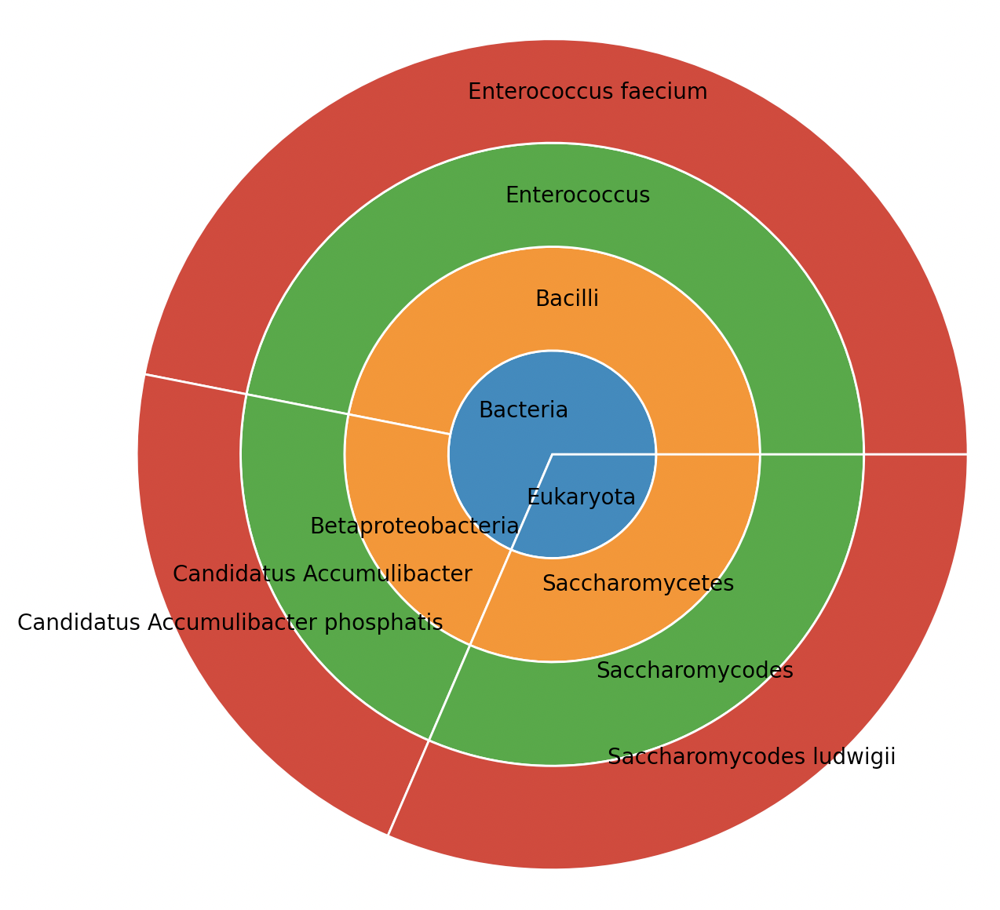
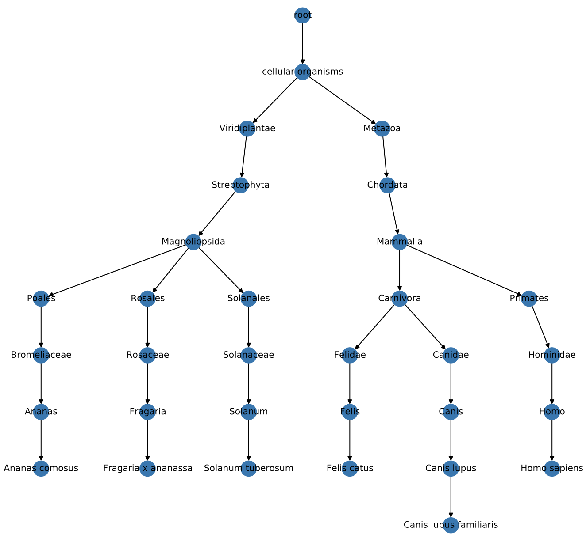

# metagenompy

[](https://pypi.python.org/pypi/metagenompy)
[](https://github.com/kpj/metagenompy/actions)

Your all-inclusive package for aggregating and visualizing metagenomic BLAST results.


## Installation

```bash
$ pip install metagenompy
```


## Usage

### Summary statistics for BLAST results

After blasting your reads against a [sequence database](ftp://ftp.ncbi.nlm.nih.gov/blast/db/FASTA/), generating summary reports using `metagenompy` is a blast.

```python
import metagenompy


# read BLAST results file with columns 'qseqid' and 'staxids'
df = (pd.read_csv('blast_result.csv')
        .set_index('qseqid')['staxids']
        .str.split(';')
        .explode()
        .dropna()
        .reset_index()
        .rename(columns={'staxids': 'taxid'})
)

df.head()
##    qseqid    taxid
## 0   read1   648716
## 1   read1  1797690
## 2   read1  1817827
## 3   read1  2580422
## 4   read1     1451

# classify taxons at multiple ranks
rank_list = ['species', 'genus', 'class', 'superkingdom']
df = metagenompy.classify_dataframe(
    graph, df,
    rank_list=rank_list
)

# aggregate read matches
agg_rank = 'genus'
df_agg = metagenompy.aggregate_classifications(df, agg_rank)

df_agg.head()
##         taxid                   species            genus            class superkingdom
## qseqid
## read1    <NA>                      <NA>             <NA>             <NA>         <NA>
## read2   36035  Saccharomycodes ludwigii  Saccharomycodes  Saccharomycetes    Eukaryota
## read3    1352      Enterococcus faecium     Enterococcus          Bacilli     Bacteria
## read4    1352      Enterococcus faecium     Enterococcus          Bacilli     Bacteria
## read5    1352      Enterococcus faecium     Enterococcus          Bacilli     Bacteria

# visualize outcome
metagenompy.plot_piechart(df_agg)
```



### NCBI taxonomy as NetworkX object

The core of `metagenompy` is a taxonomy as a networkX object.
This means that all your favorite algorithms work right out of the box.

```python
import metagenompy
import networkx as nx


# load taxonomy
graph = metagenompy.generate_taxonomy_network()

# print path from human to pineapple
for node in nx.shortest_path(graph.to_undirected(as_view=True), '9606', '4615'):
    print(node, graph.nodes[node])
## 9606 {'rank': 'species', 'authority': 'Homo sapiens Linnaeus, 1758', 'scientific_name': 'Homo sapiens', 'genbank_common_name': 'human', 'common_name': 'man'}
## 9605 {'rank': 'genus', 'authority': 'Homo Linnaeus, 1758', 'scientific_name': 'Homo', 'common_name': 'humans'}
## [..]
## 4614 {'rank': 'genus', 'authority': 'Ananas Mill., 1754', 'scientific_name': 'Ananas'}
## 4615 {'rank': 'species', 'authority': ['Ananas comosus (L.) Merr., 1917', 'Ananas lucidus Mill., 1754'], 'scientific_name': 'Ananas comosus', 'synonym': ['Ananas comosus var. comosus', 'Ananas lucidus'], 'genbank_common_name': 'pineapple'}
```

### Easy transformation and visualization of taxonomic tree

Extract taxonomic entities of interest and visualize their relations:

```python
import metagenompy
import matplotlib.pyplot as plt


# load and condense taxonomy to relevant ranks
graph = metagenompy.generate_taxonomy_network()
metagenompy.condense_taxonomy(graph)

# highlight interesting nodes
graph_zoom = metagenompy.highlight_nodes(graph, [
    '9606',  # human
    '9685',  # cat
    '9615',  # dog
    '4615',  # pineapple
    '3747',  # strawberry
    '4113',  # potato
])

# visualize result
fig, ax = plt.subplots(figsize=(10, 10))
metagenompy.plot_network(graph_zoom, ax=ax, labels_kws=dict(font_size=10))
fig.tight_layout()
fig.savefig('taxonomy.pdf')
```


